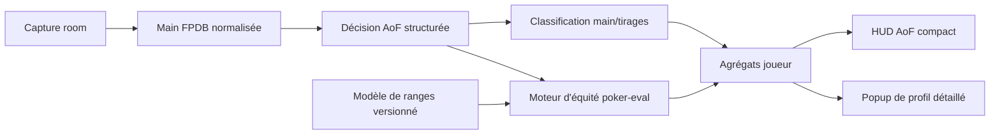

# Plan d’évolution du HUD All-in or Fold

## Objectif

Compléter le HUD All-in or Fold avec :

- les proportions agrégées de tapis observés sans main faite, avec main faite, wrap ou tirage couleur ;
- l’équité contre les cartes réellement montrées ;
- l’équité contre une range ;
- l’EV conditionnelle contre les payeurs réellement observés ;
- l’EV complète de la décision ;
- un indicateur `Weak AI%` statistiquement défendable ;
- une variante AoF Hold’em distincte ;
- une architecture réutilisable par d’autres rooms.

`poker-eval` et son interface Python `pypokereval` seront utilisés comme moteur
d’évaluation. Ils évaluent des cartes données ; FPDB devra construire et
échantillonner les ranges pondérées autour de ce moteur.

## Architecture cible



La séparation retenue est :

- `PlayerAutoNotes` conserve le texte lisible ;
- une nouvelle structure relationnelle conserve les données calculables ;
- le HUD ne relit ni ne parse le texte des notes pour produire ses statistiques.

## Contrats statistiques

| Statistique | Contrat |
|---|---|
| `AI%` | Tapis / décisions réellement reçues |
| `F%` | Folds / décisions réellement reçues |
| `Obs` | Tapis dont les cartes fermées complètes et le flop sont connus |
| `NoMade%` | Aucune main faite / `Obs` |
| `NFD%` | Nut flush draw / `Obs` |
| `Wrap9+%` | Au moins 9 outs de quinte / `Obs` |
| `BigWrap13+%` | Au moins 13 outs de quinte / `Obs` |
| `Eq known` | Équité contre toutes les mains adverses effectivement connues |
| `EV known` | EV conditionnelle contre les adversaires réellement présents |
| `Eq range` | Équité contre un modèle de range nommé et versionné |
| `Decision EV` | EV au moment de la décision, avec fold equity et rake |
| `Weak AI%` | Tapis modélisés dont l’EV est négative avec une confiance suffisante |

Les catégories de tirages peuvent se chevaucher. Une main peut par exemple être
simultanément `NoMade`, `NFD` et `BigWrap13+`. Le HUD doit toujours afficher le
numérateur et le dénominateur.

## Lot 0 — Stabiliser la livraison actuelle

**Statut : terminé le 28 juillet 2026.**

Le paquet, la migration idempotente, l’import depuis les préférences, le
profil livré, les statistiques et les notes automatiques ont été vérifiés
ensemble. La capture brute et le test tournoi hors périmètre sont restés hors
du commit. Une panne persistante du stockage des notes vide également son lot
en attente, afin de ne pas réessayer un historique croissant à chaque main.

Le HUD importable et sa migration sont déjà présents dans le worktree :

- `aof_omaha.fpdbhud` ;
- `fpdb_3_legacy/hud_package.py` ;
- `test/test_aof_hud_package.py`.

Avant de poursuivre :

1. terminer la vérification du paquet et de la migration idempotente ;
2. isoler ce lot dans un commit ;
3. ne pas embarquer la capture brute
   `CoinPoker_jeje1976_2026_02_01_to_2026_07_20_Cash.txt` ;
4. examiner le fichier temporaire
   `test/test_database_tournament_results.pyf5cdd117` ;
5. conserver les personnalisations HUD existantes pendant la migration.

Critère de sortie : une installation neuve et une ancienne configuration
obtiennent toutes deux `aof_omaha → aof_default`, sans écrasement d’un profil
utilisateur.

## Lot 1 — Modèle de données AoF structuré

### Table `AofDecisions`

Créer une ligne par joueur et par décision contenant :

- `handId` et `playerId` ;
- la catégorie `aof_omaha` ou `aof_holdem` ;
- la décision `fold` ou `allin` ;
- le rôle `open_shove`, `call_shove` ou `overcall` ;
- le nombre d’adversaires encore actifs ;
- le pot avant la décision ;
- le montant supplémentaire à engager ;
- les blindes déjà engagées, considérées comme perdues au point de décision ;
- le statut connu ou caché des cartes ;
- la main faite ;
- le nut ou non-nut flush draw ;
- le nombre brut d’outs de quinte ;
- la version du classificateur.

### Table `AofDecisionAnalyses`

Conserver séparément les résultats recalculables :

- la référence à la décision ;
- le backend d’évaluation ;
- le modèle de range et sa version ;
- l’équité ;
- l’EV brute et l’EV en big blinds ;
- le seuil d’équité nécessaire ;
- le nombre de simulations ;
- la marge d’erreur ;
- le statut `weak`, `strong` ou `uncertain`.

La classification de `fpdb_3_legacy/autonotes_aof.py` devient le producteur
unique de données structurées. Les notes textuelles sont générées à partir de
cette structure.

### Tests

- migrations SQLite, MySQL et PostgreSQL ;
- idempotence par `handId/playerId/version` ;
- backfill rejouable ;
- aucune double décision après un réimport ;
- cartes cachées enregistrées comme non observables.

## Lot 2 — Profil objectif sans équité

Ajouter une requête groupée recevant tous les `playerId` d’une table et
retournant :

- `Obs` ;
- `NoMade%` ;
- `Made%` ;
- `NFD%` et `nonNFD%` ;
- `Wrap9+%` ;
- `BigWrap13+%` ;
- la distribution paire/deux paires/brelan/quinte/couleur/full.

Le HUD ne doit jamais effectuer une requête par joueur.

### Présentation

Conserver deux profils :

- `aof_default`, compact pour le multitabling ;
- `aof_advanced`, avec `Obs`, `Weak` et `EV`.

Le détail est placé dans un popup :

```text
Tapis observés : 18

Sans main faite   10/18  55,6 %
Nut flush draw     6/18  33,3 %
Wrap 9+            8/18  44,4 %
Big wrap 13+       3/18  16,7 %
Main faite         8/18  44,4 %
```

### Critères de performance

- au maximum une requête supplémentaire par table rafraîchie ;
- aucune requête par cellule ou joueur ;
- aucun appel au classificateur depuis le thread graphique ;
- douze tables et une main chacune restent à douze rafraîchissements principaux.

## Lot 3 — Service d’équité `pypokereval`

Étendre `fpdb_3_legacy/equity.py` derrière une interface indépendante :

```text
EquityEngine
├── evaluate_exact(...)
├── evaluate_uniform_unknown(...)
└── evaluate_weighted_range(...)
```

### Équité exacte

`pypokereval.poker_eval` reçoit :

- `game="omaha"` ou `game="holdem"` ;
- les cartes connues des participants ;
- le flop connu au moment de la décision ;
- le turn et la river sous forme de cartes inconnues ;
- les cartes mortes éventuelles.

Le turn et la river finalement distribués ne doivent jamais être transmis pour
calculer une équité au flop.

### Équité contre une range

Mesurer trois stratégies :

1. appeler `poker_eval` pour chaque main adverse échantillonnée ;
2. utiliser les fonctions natives `best()` ou `winners()` pour une boucle
   Monte-Carlo plus fine ;
3. utiliser les cartes `__` de poker-eval pour une range uniforme, si l’API
   Omaha les accepte correctement.

Le choix est fondé sur un benchmark PLO4 heads-up et multiway.

### Exécution asynchrone

L’évaluation ne doit bloquer ni l’import, ni le pump de capture, ni le thread Qt.

Le flux est :

1. valider et committer la main ;
2. persister la décision AoF ;
3. placer le travail d’analyse dans une file bornée ;
4. écrire le résultat dans une transaction séparée ;
5. notifier le HUD lorsque l’analyse est disponible.

Le cache est indexé par :

```text
game + cartes hero + board + cartes mortes
+ adversaires/modèle de range + version du modèle + budget d’échantillons
```

Sans `pypokereval`, les statistiques objectives restent disponibles et les
équités affichent `–`. Une seule alerte signale l’indisponibilité du backend.

## Lot 4 — Équité et EV contre les cartes connues

Cette première version ne dépend d’aucun modèle de range.

Conditions :

- toutes les mains encore éligibles au pot doivent être connues ;
- les joueurs couchés sont exclus de l’évaluation, mais leur argent reste dans
  le pot ;
- les side pots sont évalués séparément ;
- le calcul part du flop présent au moment de la décision.

Pour un call :

```text
EV connue = équité × pot final après rake − montant restant à payer
```

Pour un open shove, le résultat est conditionné au fait qu’un adversaire a
effectivement payé. Il est donc nommé :

- `Eq known` ;
- `EV vs actual callers`.

Il ne doit pas être présenté comme la rentabilité initiale du shove.

### Tests

- heads-up ;
- multiway ;
- argent mort d’un joueur couché ;
- side pots ;
- split pots ;
- cartes adverses partiellement cachées ;
- comparaison avec des sorties natives connues de poker-eval.

## Lot 5 — Modèle de ranges AoF

Créer une interface :

```text
RangeModel
├── UniformLegalRange
├── PopulationObservedRange
└── PlayerSpecificRange
```

### V1 — Range uniforme

Elle sert à valider le moteur, mais ne doit pas alimenter `Weak AI%`, car elle ne
représente pas le comportement humain.

### V2 — Range population

La range est construite à partir des mains observées et séparée par :

- room ;
- variante `aof_omaha` ou `aof_holdem` ;
- rôle `open_shove`, `call_shove` ou `overcall` ;
- nombre de joueurs encore actifs ;
- éventuellement profondeur et niveau de blindes.

La main en cours et les mains futures sont exclues. Le modèle porte :

- un identifiant ;
- une version ;
- une date de construction ;
- une taille d’échantillon ;
- ses conditions de filtrage.

### V3 — Range joueur

La range du joueur est mélangée avec celle de la population :

- petit échantillon : poids principal à la population ;
- grand échantillon : poids croissant au joueur ;
- minimum d’observations avant affichage.

Le HUD doit signaler le biais d’observation : les cartes adverses sont surtout
connues lorsque la main atteint l’abattage.

### Validation

Utiliser un découpage chronologique entraînement/test et contrôler :

- l’équité prédite ;
- la fréquence réelle de gain ;
- l’erreur par tranche d’équité ;
- la stabilité entre périodes ;
- la couverture des mains cachées.

`Weak AI%` reste désactivé jusqu’à validation de la calibration.

## Lot 6 — EV réelle de décision et `Weak AI%`

### Call d’un tapis

```text
EV(call) = équité_range × pot_après_rake − montant_à_payer
EV(fold) = 0 depuis le point de décision
```

Les blindes déjà posées sont irrécupérables et ne sont pas soustraites une
seconde fois.

### Open shove

Modéliser toutes les branches :

```text
EV(shove)
= P(tous foldent) × pot déjà présent
+ somme des scénarios d'appel
  P(scénario) × EV contre les ranges correspondantes
```

En multiway, le moteur échantillonne :

- les joueurs qui paient ;
- leurs mains ;
- les runouts ;
- les pots auxquels chacun est éligible ;
- le rake propre à la room.

Sans modèle de rake connu, le résultat est explicitement nommé `EV pre-rake`.

### Définition de `Weak AI%`

Un tapis est `weak` lorsque :

```text
borne supérieure de l’intervalle de confiance de l’EV < 0
```

Les décisions dont l’intervalle traverse zéro sont `uncertain`.

Exemple d’affichage :

```text
W 27.3 (3/11)
```

Cela signifie trois tapis clairement négatifs sur onze tapis modélisables. Les
tapis cachés ou sans modèle suffisant n’entrent pas dans le dénominateur.

## Lot 7 — AoF Hold’em

Créer une catégorie distincte `aof_holdem`, jamais un alias de `holdem`.

Travail nécessaire :

- registre du jeu et `fpdb_supported` ;
- profil de streets AoF ;
- conversion des actions et des blindes ;
- calcul AI/F dédié ;
- classificateur deux cartes ;
- évaluation `pypokereval game="holdem"` ;
- modèle de ranges séparé ;
- profil HUD ;
- fixture brute réelle ;
- test capture → main → SQLite → analyse → HUD.

Les mains actuellement conservées en `capture_only` peuvent amorcer le travail,
mais il faut au moins une fixture complète avec cartes montrées et règlement
vérifiable.

La variante ne devient importable qu’après validation des actions, pots, cartes,
gains et rake.

## Lot 8 — Compatibilité multi-room

Rendre le cœur AoF indépendant de CoinPoker avec un contrat `AofRuleset` :

- nombre de cartes fermées ;
- board présent ou non avant la décision ;
- décisions permises ;
- traitement des blindes ;
- stacks égaux ou non ;
- structure multiway ;
- rake ;
- catégorie FPDB correspondante.

Une room peut réutiliser `aof_omaha` seulement si ces sémantiques sont réellement
équivalentes. Dans le cas contraire, elle reçoit une nouvelle catégorie ou reste
`capture_only`.

Chaque room doit fournir :

1. une fixture brute anonymisée ;
2. le mapping du code de jeu ;
3. la normalisation ;
4. des actions déterministes ;
5. le règlement, les pots et le rake ;
6. un import SQLite ;
7. l’apparition du HUD ;
8. un test de non-contamination avec les tables ordinaires.

Les modèles de ranges restent séparés par room par défaut.

## Stratégie de tests globale

### Tests unitaires

- évaluation Omaha utilisant exactement deux cartes sur quatre ;
- cartes mortes et doublons ;
- outs de quinte ;
- nut et non-nut draws ;
- range pondérée ;
- EV de call et de shove ;
- intervalles de confiance.

### Intégration native

Ajouter une tâche CI avec `pypoker-eval` installé couvrant :

- Hold’em ;
- Omaha ;
- flop incomplet ;
- multiway ;
- résultats exhaustifs connus.

Les autres tâches peuvent utiliser une doublure du backend, mais au moins une
tâche doit charger l’extension native.

### Base de données

- SQLite obligatoire ;
- syntaxe MySQL et PostgreSQL ;
- migrations idempotentes ;
- backfill interrompu puis repris ;
- changement de version du modèle ;
- conservation des anciennes analyses.

### Bout en bout

```text
fixture brute
→ Hand FPDB
→ SQLite
→ AofDecisions
→ analyse pypokereval
→ agrégat joueur
→ stat_dict
→ HUD
```

### Non-régression

- Hold’em et Omaha ordinaires inchangés ;
- une panne d’équité ne perd jamais une main ;
- une panne de stockage d’analyse ne bloque pas les suivantes ;
- les variantes non représentables restent `capture_only` ;
- aucun N+1 sur douze tables.

## Ordre de livraison recommandé

1. commit du paquet HUD et de la migration actuels ;
2. tables structurées et backfill ;
3. profil objectif `Obs/NoMade/NFD/Wrap` ;
4. backend `pypokereval` asynchrone ;
5. `Eq known` et `EV vs actual callers` ;
6. modèle population versionné ;
7. `Decision EV` et `Weak AI%` ;
8. AoF Hold’em ;
9. premier adaptateur pour une autre room.

Les lots 1 à 5 donnent un HUD utile sans prétendre connaître une range. Les lots
6 et 7 sont expérimentaux et doivent être affichés comme tels jusqu’à validation
de leur calibration.
