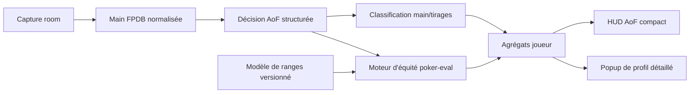

# Plan d’évolution du HUD All-in or Fold

## Objectif

Compléter le HUD All-in or Fold avec :

- les proportions agrégées de tapis observés sans main faite, avec main faite, wrap ou tirage couleur ;
- l’équité contre les cartes réellement montrées ;
- l’équité contre une range ;
- l’EV conditionnelle contre les payeurs réellement observés ;
- l’EV complète de la décision ;
- un indicateur `Weak AI%` statistiquement défendable ;
- une variante AoF Hold’em distincte ;
- une architecture réutilisable par d’autres rooms.

`poker-eval` et son interface Python `pypokereval` seront utilisés comme moteur
d’évaluation. Ils évaluent des cartes données ; FPDB devra construire et
échantillonner les ranges pondérées autour de ce moteur.

## Architecture cible



La séparation retenue est :

- `PlayerAutoNotes` conserve le texte lisible ;
- une nouvelle structure relationnelle conserve les données calculables ;
- le HUD ne relit ni ne parse le texte des notes pour produire ses statistiques.

## Contrats statistiques

| Statistique | Contrat |
|---|---|
| `AI%` | Tapis / décisions réellement reçues |
| `F%` | Folds / décisions réellement reçues |
| `Obs` | Tapis dont les cartes fermées complètes et le flop sont connus |
| `NoMade%` | Aucune main faite / `Obs` |
| `NFD%` | Nut flush draw / `Obs` |
| `Wrap9+%` | Au moins 9 outs de quinte / `Obs` |
| `BigWrap13+%` | Au moins 13 outs de quinte / `Obs` |
| `Eq known` | Équité contre toutes les mains adverses effectivement connues |
| `EV known` | EV conditionnelle contre les adversaires réellement présents |
| `Eq range` | Équité contre un modèle de range nommé et versionné |
| `Decision EV` | EV au moment de la décision, avec fold equity et rake |
| `Weak AI%` | Tapis modélisés dont l’EV est négative avec une confiance suffisante |

Les catégories de tirages peuvent se chevaucher. Une main peut par exemple être
simultanément `NoMade`, `NFD` et `BigWrap13+`. Le HUD doit toujours afficher le
numérateur et le dénominateur.

## Lot 0 — Stabiliser la livraison actuelle

**Statut : terminé le 28 juillet 2026.**

Le paquet, la migration idempotente, l’import depuis les préférences, le
profil livré, les statistiques et les notes automatiques ont été vérifiés
ensemble. La capture brute et le test tournoi hors périmètre sont restés hors
du commit. Une panne persistante du stockage des notes vide également son lot
en attente, afin de ne pas réessayer un historique croissant à chaque main.

Le HUD importable et sa migration sont déjà présents dans le worktree :

- `aof_omaha.fpdbhud` ;
- `fpdb_3_legacy/hud_package.py` ;
- `test/test_aof_hud_package.py`.

Avant de poursuivre :

1. terminer la vérification du paquet et de la migration idempotente ;
2. isoler ce lot dans un commit ;
3. ne pas embarquer la capture brute
   `CoinPoker_jeje1976_2026_02_01_to_2026_07_20_Cash.txt` ;
4. examiner le fichier temporaire
   `test/test_database_tournament_results.pyf5cdd117` ;
5. conserver les personnalisations HUD existantes pendant la migration.

Critère de sortie : une installation neuve et une ancienne configuration
obtiennent toutes deux `aof_omaha → aof_default`, sans écrasement d’un profil
utilisateur.

## Lot 1 — Modèle de données AoF structuré

**Statut : terminé le 28 juillet 2026.**

Les décisions sont produites une fois par le classificateur, puis utilisées
pour les notes textuelles et persistées après la main dans une transaction
indépendante. Les montants sont des centimes entiers, comme dans le schéma
FPDB existant. Les cartes cachées restent des décisions exploitables pour
`AI%`/`F%`, mais leurs cartes et leur classification sont nulles.

Le backfill parcourt les mains par identifiant croissant, committe par lots et
rend le dernier `handId` traité. Il peut être repris avec `--start-after` ou
rejoué intégralement : la clé `(handId, playerId, classifierVersion)` empêche
les doublons.

Les résultats recalculables sont également sans flottants en base :
équité/seuil/erreur en parties par million, EV brute en centimes et EV en BB en
millionièmes. Leur clé inclut le backend, sa version, le modèle de range et les
versions du modèle et de l’analyse.

### Table `AofDecisions`

Créer une ligne par joueur et par décision contenant :

- `handId` et `playerId` ;
- la catégorie `aof_omaha` ou `aof_holdem` ;
- la décision `fold` ou `allin` ;
- le rôle `open_shove`, `call_shove` ou `overcall` ;
- le nombre d’adversaires encore actifs ;
- le pot avant la décision ;
- le montant supplémentaire à engager ;
- les blindes déjà engagées, considérées comme perdues au point de décision ;
- le statut connu ou caché des cartes ;
- la main faite ;
- le nut ou non-nut flush draw ;
- le nombre brut d’outs de quinte ;
- la version du classificateur.

### Table `AofDecisionAnalyses`

Conserver séparément les résultats recalculables :

- la référence à la décision ;
- le backend d’évaluation ;
- le modèle de range et sa version ;
- l’équité ;
- l’EV brute et l’EV en big blinds ;
- le seuil d’équité nécessaire ;
- le nombre de simulations ;
- la marge d’erreur ;
- le statut de disponibilité `complete`, `incomplete` ou `no_callers` pour
  l'analyse exacte, puis `weak`, `strong` ou `uncertain` pour les modèles de
  ranges.

La classification de `fpdb_3_legacy/autonotes_aof.py` devient le producteur
unique de données structurées. Les notes textuelles sont générées à partir de
cette structure.

### Tests

- migrations SQLite, MySQL et PostgreSQL ;
- idempotence par `handId/playerId/version` ;
- backfill rejouable ;
- aucune double décision après un réimport ;
- cartes cachées enregistrées comme non observables.

## Lot 2 — Profil objectif sans équité

**Statut : terminé le 28 juillet 2026.**

Le HUD fusionne les agrégats de tous les joueurs assis avec une seule requête
groupée par table. La catégorie du HUD est transmise explicitement au lecteur
de statistiques : les jeux ordinaires n'exécutent donc aucune lecture AoF
supplémentaire. Les pourcentages conservent tous leur numérateur et leur
dénominateur `Obs`, et les catégories de tirages restent volontairement
chevauchantes.

`aof_default` reste compact et remplace l'ancien compteur de showdowns par le
vrai échantillon observable. `aof_advanced` expose les mesures objectives et
réserve les cellules `Weak` et `EV`, affichées `–` jusqu'aux lots d'équité. Le
popup `aof_profile` porte le détail complet et la distribution des mains
faites. Le paquet, la configuration livrée, le modèle d'exemple, l'import
explicite et la migration idempotente installent les deux profils et le popup
sans remplacer une personnalisation existante.

Ajouter une requête groupée recevant tous les `playerId` d’une table et
retournant :

- `Obs` ;
- `NoMade%` ;
- `Made%` ;
- `NFD%` et `nonNFD%` ;
- `Wrap9+%` ;
- `BigWrap13+%` ;
- la distribution paire/deux paires/brelan/quinte/couleur/full.

Le HUD ne doit jamais effectuer une requête par joueur.

### Présentation

Conserver deux profils :

- `aof_default`, compact pour le multitabling ;
- `aof_advanced`, avec `Obs`, `Weak` et `EV`.

Le détail est placé dans un popup :

```text
Tapis observés : 18

Sans main faite   10/18  55,6 %
Nut flush draw     6/18  33,3 %
Wrap 9+            8/18  44,4 %
Big wrap 13+       3/18  16,7 %
Main faite         8/18  44,4 %
```

### Critères de performance

- au maximum une requête supplémentaire par table rafraîchie ;
- aucune requête par cellule ou joueur ;
- aucun appel au classificateur depuis le thread graphique ;
- douze tables et une main chacune restent à douze rafraîchissements principaux.

## Lot 3 — Service d’équité `pypokereval`

**Statut : terminé le 28 juillet 2026.**

Les deux dépôts ont été rafraîchis avant l’implémentation. Leur branche par
défaut `master` est exactement alignée sur `origin/master` :

- `poker-eval` : `852a12dde3fb5815f014d9211cfff956e3b06f33` ;
- `pypoker-eval` : `3a93da165a469bdfe2361995bda0f9344439c544`.

Le second dépôt épingle volontairement son sous-module `poker-eval` sur
`21d4185d06eccf9968c4a0a9a74a82ec2682acc7`. Ce pointeur est bien celui du
dernier commit `pypoker-eval`; il n’a pas été remplacé silencieusement par le
sommet du dépôt autonome. L’extension Python 3.11.15 a été compilée dans un
répertoire temporaire depuis cet état exact, sans modifier les deux dépôts.
Le wrapper encode la version Python complète dans le nom de l’extension
(`_pokereval_3_11_15`) : une bibliothèque construite pour 3.11.10 ou 3.13.13
ne peut donc pas être chargée par le runtime FPDB 3.11.15.

Le benchmark natif PLO4 au flop, avec 20 000 échantillons, tranche le choix
d’implémentation :

| Stratégie | Heads-up | Trois joueurs |
|---|---:|---:|
| `poker_eval` avec poches `__` | 1,92 M éch./s | 1,29 M éch./s |
| `poker_eval` regroupé par poche pondérée | 2,10 M éch./s | 1,41 M éch./s |
| boucle Python avec `winners()` | 0,32 M éch./s | 0,25 M éch./s |

`EquityEngine` utilise donc un appel natif pour la range uniforme et regroupe
les mêmes combinaisons pondérées avant de les envoyer au backend. Les petits
produits cartésiens sont répartis exactement selon leurs poids ; les grands
sont échantillonnés avec une graine explicite et les collisions de cartes sont
rejetées. Le cache LRU est borné et sa clé contient la version du moteur, le
jeu, les cartes, le modèle de range, sa version, la graine et le budget.

`AsyncEquityService` fournit la file bornée et dédupliquée. Le calcul, la
persistance et la notification s’exécutent dans cet ordre sur le worker. Le
contrat interdit de partager la connexion de l’importeur : le callback de
persistance possède sa connexion et sa transaction. Les producteurs concrets
`Eq known` et `Eq range` seront branchés respectivement dans les lots 4 et 5 ;
jusque-là, aucun calcul ne part de l’importeur ni du thread Qt et les cellules
`Weak`/`EV` restent `–`.

Étendre `fpdb_3_legacy/equity.py` derrière une interface indépendante :

```text
EquityEngine
├── evaluate_exact(...)
├── evaluate_uniform_unknown(...)
└── evaluate_weighted_range(...)
```

### Équité exacte

`pypokereval.poker_eval` reçoit :

- `game="omaha"` ou `game="holdem"` ;
- les cartes connues des participants ;
- le flop connu au moment de la décision ;
- le turn et la river sous forme de cartes inconnues ;
- les cartes mortes éventuelles.

Le turn et la river finalement distribués ne doivent jamais être transmis pour
calculer une équité au flop.

### Équité contre une range

Mesurer trois stratégies :

1. appeler `poker_eval` pour chaque main adverse échantillonnée ;
2. utiliser les fonctions natives `best()` ou `winners()` pour une boucle
   Monte-Carlo plus fine ;
3. utiliser les cartes `__` de poker-eval pour une range uniforme, si l’API
   Omaha les accepte correctement.

Le choix est fondé sur un benchmark PLO4 heads-up et multiway.

### Exécution asynchrone

L’évaluation ne doit bloquer ni l’import, ni le pump de capture, ni le thread Qt.

Le flux est :

1. valider et committer la main ;
2. persister la décision AoF ;
3. placer le travail d’analyse dans une file bornée ;
4. écrire le résultat dans une transaction séparée ;
5. notifier le HUD lorsque l’analyse est disponible.

Le cache est indexé par :

```text
game + cartes hero + board + cartes mortes
+ adversaires/modèle de range + version du modèle + budget d’échantillons
```

Sans `pypokereval`, les statistiques objectives restent disponibles et les
équités affichent `–`. Une seule alerte signale l’indisponibilité du backend.

## Lot 4 — Équité et EV contre les cartes connues

**Statut : terminé le 28 juillet 2026.**

`fpdb_3_legacy/aof_equity.py` prend un instantané immuable de la main une fois
la main et ses décisions committées. Il reconstruit les pots par niveaux
d'engagement plutôt que de prendre `Hand.pot.pots` pour une liste
d'éligibilité : cette dernière contient les contributeurs, y compris ceux qui
se sont couchés. Les jetons des joueurs couchés restent donc dans le pot,
leurs cartes connues deviennent des cartes mortes, mais ils ne participent
jamais à l'équité.

Chaque side pot est évalué avec son propre ensemble de joueurs éligibles. Le
rake, que l'historique ne ventile pas par side pot, est réparti
proportionnellement entre les couches, au centime près, avant le calcul de
l'espérance. L'équité agrégée est la part attendue pondérée par les pots nets
auxquels le joueur a droit. L'EV soustrait seulement le montant restant à
engager au point de décision ; les blindes déjà posées sont un coût passé.

Le turn et la river finaux ne sont jamais copiés dans la requête : le backend
reçoit le flop et deux cartes communes inconnues. Une poche cachée d'un joueur
encore éligible produit un résultat `incomplete`, et un tapis que personne n'a
payé produit `no_callers`. Aucun des deux n'est maquillé en équité.

Le live capture place une seule tâche par main dans `AsyncEquityService`,
après le commit et la première notification du HUD. Le worker calcule toutes
les décisions, ouvre sa propre connexion de base, les persiste dans une seule
transaction puis notifie une seule fois le HUD. Une panne de préparation ou
de file ne remet jamais une main déjà committée en échec.

La lecture HUD reste groupée : le même `getAofProfileStats` retourne le nombre
d'analyses connues, leur somme d'équité et leur somme d'EV en BB pour tous les
joueurs assis. `EqK` est visible dans le popup ; la cellule avancée affiche
`EVact`, explicitement « EV vs actual callers ». `Decision EV` et `Weak`
restent à `–` jusqu'aux lots de ranges. La migration remplace uniquement
l'ancien placeholder livré en `(4,3)` et étend le popup sans écraser ses
couleurs, son thème ou les autres lignes utilisateur.

Les sorties natives de contrôle sont épinglées : le cas PLO4 connu énumère
820 boards et donne 71,4 %, le cas Hold'em connu en énumère 990 et donne
91,2 %. Les tests couvrent également le heads-up, le multiway, l'argent mort,
les side pots, le rake proportionnel, les splits, les poches partiellement
cachées, l'ordre notification/file et la persistance groupée.

Cette première version ne dépend d’aucun modèle de range.

Conditions :

- toutes les mains encore éligibles au pot doivent être connues ;
- les joueurs couchés sont exclus de l’évaluation, mais leur argent reste dans
  le pot ;
- les side pots sont évalués séparément ;
- le calcul part du flop présent au moment de la décision.

Pour un call :

```text
EV connue = équité × pot final après rake − montant restant à payer
```

Pour un open shove, le résultat est conditionné au fait qu’un adversaire a
effectivement payé. Il est donc nommé :

- `Eq known` ;
- `EV vs actual callers`.

Il ne doit pas être présenté comme la rentabilité initiale du shove.

### Tests

- heads-up ;
- multiway ;
- argent mort d’un joueur couché ;
- side pots ;
- split pots ;
- cartes adverses partiellement cachées ;
- comparaison avec des sorties natives connues de poker-eval.

## Lot 5 — Modèle de ranges AoF

**Statut : terminé le 28 juillet 2026.**

`fpdb_3_legacy/aof_ranges.py` fournit le contrat commun et les trois
implémentations prévues. Chaque instantané porte son identifiant, sa version,
sa date de construction, ses conditions et ses tailles d'échantillon. Le biais
d'observation est une donnée explicite du modèle : les folds cachés et les
tapis non montrés sont absents de la distribution de cartes.

La range population est séparée par site, catégorie, rôle et nombre
d'adversaires actifs. Son minimum livré est de 25 observations. La sélection
historique est doublement gardée : la requête SQL et le modèle refusent la
main courante et les mains futures. Le cutoff est `(startTime, handId)`, et
non le seul identifiant d'import, afin qu'une vieille main réimportée ne puisse
pas apprendre d'une main jouée plus tard. La fenêtre est bornée aux 5 000
observations antérieures les plus récentes par contexte : la lecture d'une
session longue reste donc bornée au lieu de devenir quadratique. Un index
composite couvre le chemin de lecture.

La range joueur mélange sa distribution avec la population par shrinkage :
elle exige au moins 5 observations personnelles et utilise une force de prior
de 25. À cinq observations, la population porte donc encore cinq sixièmes du
poids ; l'influence du joueur augmente progressivement. Cette V3 est
construite et testée, mais n'est pas encore choisie par le HUD tant qu'une
calibration réelle n'a pas validé son avantage sur la population.

La range uniforme passe par `evaluate_uniform_unknown`; les ranges observées
passent par `evaluate_weighted_range`. Les deux ne peuvent pas être mélangées
silencieusement dans une même évaluation. La sortie native PLO4 observée est
épinglée avec une graine et 20 000 simulations.

Le worker du lot 4 calcule maintenant `Eq known` et `Eq range` dans le même
job, les persiste ensemble puis ne notifie le HUD qu'une fois. `EqR` agrège
uniquement les analyses complètes de `population_observed` et apparaît dans le
popup avec la mention du biais et du cutoff historique. Une range insuffisante
reste `incomplete` et n'appelle pas le backend.

Le rapport de validation effectue un découpage chronologique entraînement/test
et mesure l'équité prédite, la part réellement gagnée, l'erreur par tranche,
le score de Brier, la stabilité entre les deux moitiés du holdout et la
couverture des cartes observables. Il ne transforme pas à lui seul le modèle
en modèle validé : `Weak AI%` et `Decision EV` restent volontairement
désactivés jusqu'au lot 6.

Créer une interface :

```text
RangeModel
├── UniformLegalRange
├── PopulationObservedRange
└── PlayerSpecificRange
```

### V1 — Range uniforme

Elle sert à valider le moteur, mais ne doit pas alimenter `Weak AI%`, car elle ne
représente pas le comportement humain.

### V2 — Range population

La range est construite à partir des mains observées et séparée par :

- room ;
- variante `aof_omaha` ou `aof_holdem` ;
- rôle `open_shove`, `call_shove` ou `overcall` ;
- nombre de joueurs encore actifs ;
- éventuellement profondeur et niveau de blindes.

La main en cours et les mains futures sont exclues. Le modèle porte :

- un identifiant ;
- une version ;
- une date de construction ;
- une taille d’échantillon ;
- ses conditions de filtrage.

### V3 — Range joueur

La range du joueur est mélangée avec celle de la population :

- petit échantillon : poids principal à la population ;
- grand échantillon : poids croissant au joueur ;
- minimum d’observations avant affichage.

Le HUD doit signaler le biais d’observation : les cartes adverses sont surtout
connues lorsque la main atteint l’abattage.

### Validation

Utiliser un découpage chronologique entraînement/test et contrôler :

- l’équité prédite ;
- la fréquence réelle de gain ;
- l’erreur par tranche d’équité ;
- la stabilité entre périodes ;
- la couverture des mains cachées.

`Weak AI%` reste désactivé jusqu’à validation de la calibration.

## Lot 6 — EV réelle de décision et `Weak AI%`

**Statut : terminé le 28 juillet 2026.**

Le montant restant à engager est maintenant dérivé du stack initial moins les
jetons déjà posés. Cette correction est nécessaire pour les relances à tapis :
`Hand.actions` place d'abord le montant de relance dans le tuple, pas le coût
incrémental total. Sur la fixture réelle, la petite blinde engage donc 190
centimes après ses 10 centimes forcés, et le call suivant voit bien un pot de
225 centimes.

Le modèle d'actions population lit les folds et les tapis, y compris lorsque
les cartes sont cachées. Il partage les garde-fous des ranges : room,
catégorie, rôle, nombre d'adversaires, cutoff strict `(startTime, handId)`,
fenêtre récente de 5 000 décisions et minimum de 25 observations. Une
priorisation de Jeffreys évite de transformer artificiellement une fréquence
jamais observée en probabilité certaine de zéro ou un.

Chaque décision est reconstruite à son point exact. Les tapis antérieurs sont
obligatoires ; les joueurs encore à parler forment un arbre séquentiel de
fold/call/overcall. Chaque branche reconstruit les contributions et les side
pots, choisit la range correspondant au contexte de chaque caller et évalue
le flop sans jamais lire le turn, la river ou les cartes réellement montrées
plus tard. La catégorie CoinPoker AoF implique aujourd'hui des stacks égaux :
un caller futur est donc plafonné au même engagement total que le joueur
analysé. Le contrat multi-room du lot 8 devra rendre cette règle explicite
avant qu'une room aux stacks inégaux puisse réutiliser la catégorie.

Aucun barème de rake CoinPoker vérifié n'est disponible dans la capture. Le
résultat livré est donc nommé et stocké sans ambiguïté
`population_decision_ev_prerake`. Cette EV est une borne supérieure de l'EV
après rake : exiger que sa borne supérieure à 95 % soit encore négative rend
la classification `weak` conservatrice. Une décision positive à la borne
inférieure est `strong`; une décision dont l'intervalle traverse zéro est
`uncertain`. Les cartes cachées, les contextes sous le plancher et les ordres
d'action incomplets restent `incomplete` et sortent du dénominateur.

Le worker unique produit désormais `Eq known`, `Eq range` et `Decision EV`
dans le même travail, les écrit ensemble et ne notifie le HUD qu'une fois.
Le profil avancé affiche la moyenne `EV` pré-rake et `Weak AI%`; le popup
conserve aussi `EVact`, qui reste l'EV conditionnelle contre les callers
réellement observés. La migration reprend uniquement la cellule livrée
`(4,3)` sans remplacer les couleurs ou les autres statistiques utilisateur.

### Call d’un tapis

```text
EV(call) = équité_range × pot_net_si_barème_vérifié_sinon_pot_brut − montant_à_payer
EV(fold) = 0 depuis le point de décision
```

Les blindes déjà posées sont irrécupérables et ne sont pas soustraites une
seconde fois.

### Open shove

Modéliser toutes les branches :

```text
EV(shove)
= P(tous foldent) × pot déjà présent
+ somme des scénarios d'appel
  P(scénario) × EV contre les ranges correspondantes
```

En multiway, le moteur échantillonne :

- les joueurs qui paient ;
- leurs mains ;
- les runouts ;
- les pots auxquels chacun est éligible ;
- le rake propre à la room.

Sans modèle de rake connu, le résultat est explicitement nommé `EV pre-rake`.

### Définition de `Weak AI%`

Un tapis est `weak` lorsque :

```text
borne supérieure de l’intervalle de confiance de l’EV < 0
```

Les décisions dont l’intervalle traverse zéro sont `uncertain`.

Exemple d’affichage :

```text
W 27.3 (3/11)
```

Cela signifie trois tapis clairement négatifs sur onze tapis modélisables. Les
tapis cachés ou sans modèle suffisant n’entrent pas dans le dénominateur.

## Lot 7 — AoF Hold’em

Créer une catégorie distincte `aof_holdem`, jamais un alias de `holdem`.

Travail nécessaire :

- registre du jeu et `fpdb_supported` ;
- profil de streets AoF ;
- conversion des actions et des blindes ;
- calcul AI/F dédié ;
- classificateur deux cartes ;
- évaluation `pypokereval game="holdem"` ;
- modèle de ranges séparé ;
- profil HUD ;
- fixture brute réelle ;
- test capture → main → SQLite → analyse → HUD.

Les mains actuellement conservées en `capture_only` peuvent amorcer le travail,
mais il faut au moins une fixture complète avec cartes montrées et règlement
vérifiable.

La variante ne devient importable qu’après validation des actions, pots, cartes,
gains et rake.

## Lot 8 — Compatibilité multi-room

Rendre le cœur AoF indépendant de CoinPoker avec un contrat `AofRuleset` :

- nombre de cartes fermées ;
- board présent ou non avant la décision ;
- décisions permises ;
- traitement des blindes ;
- stacks égaux ou non ;
- structure multiway ;
- rake ;
- catégorie FPDB correspondante.

Une room peut réutiliser `aof_omaha` seulement si ces sémantiques sont réellement
équivalentes. Dans le cas contraire, elle reçoit une nouvelle catégorie ou reste
`capture_only`.

Chaque room doit fournir :

1. une fixture brute anonymisée ;
2. le mapping du code de jeu ;
3. la normalisation ;
4. des actions déterministes ;
5. le règlement, les pots et le rake ;
6. un import SQLite ;
7. l’apparition du HUD ;
8. un test de non-contamination avec les tables ordinaires.

Les modèles de ranges restent séparés par room par défaut.

## Stratégie de tests globale

### Tests unitaires

- évaluation Omaha utilisant exactement deux cartes sur quatre ;
- cartes mortes et doublons ;
- outs de quinte ;
- nut et non-nut draws ;
- range pondérée ;
- EV de call et de shove ;
- intervalles de confiance.

### Intégration native

Ajouter une tâche CI avec `pypoker-eval` installé couvrant :

- Hold’em ;
- Omaha ;
- flop incomplet ;
- multiway ;
- résultats exhaustifs connus.

Les autres tâches peuvent utiliser une doublure du backend, mais au moins une
tâche doit charger l’extension native.

### Base de données

- SQLite obligatoire ;
- syntaxe MySQL et PostgreSQL ;
- migrations idempotentes ;
- backfill interrompu puis repris ;
- changement de version du modèle ;
- conservation des anciennes analyses.

### Bout en bout

```text
fixture brute
→ Hand FPDB
→ SQLite
→ AofDecisions
→ analyse pypokereval
→ agrégat joueur
→ stat_dict
→ HUD
```

### Non-régression

- Hold’em et Omaha ordinaires inchangés ;
- une panne d’équité ne perd jamais une main ;
- une panne de stockage d’analyse ne bloque pas les suivantes ;
- les variantes non représentables restent `capture_only` ;
- aucun N+1 sur douze tables.

## Ordre de livraison recommandé

1. commit du paquet HUD et de la migration actuels ;
2. tables structurées et backfill ;
3. profil objectif `Obs/NoMade/NFD/Wrap` ;
4. backend `pypokereval` asynchrone ;
5. `Eq known` et `EV vs actual callers` ;
6. modèle population versionné ;
7. `Decision EV` et `Weak AI%` ;
8. AoF Hold’em ;
9. premier adaptateur pour une autre room.

Les lots 1 à 5 donnent un HUD utile sans prétendre connaître une range. Les lots
6 et 7 sont expérimentaux et doivent être affichés comme tels jusqu’à validation
de leur calibration.
