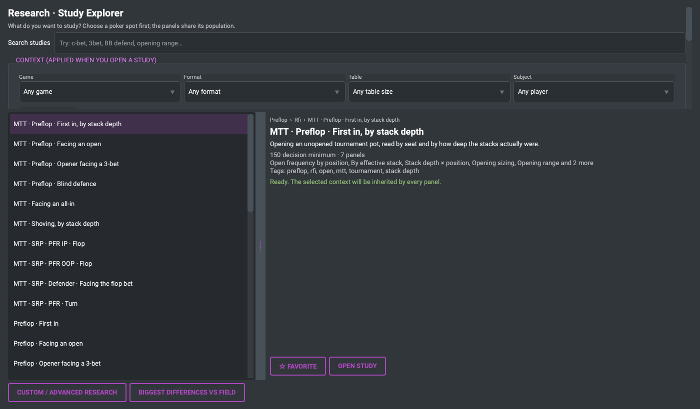
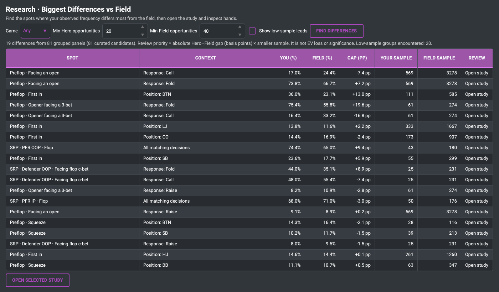
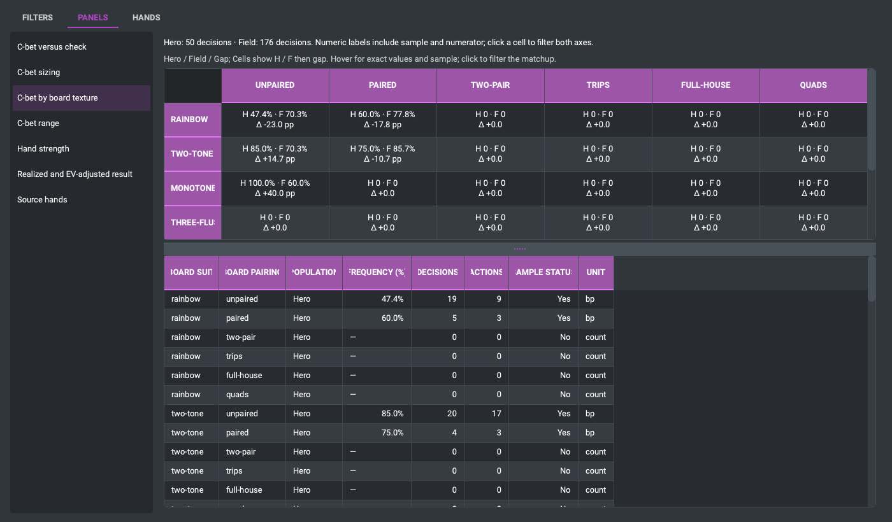
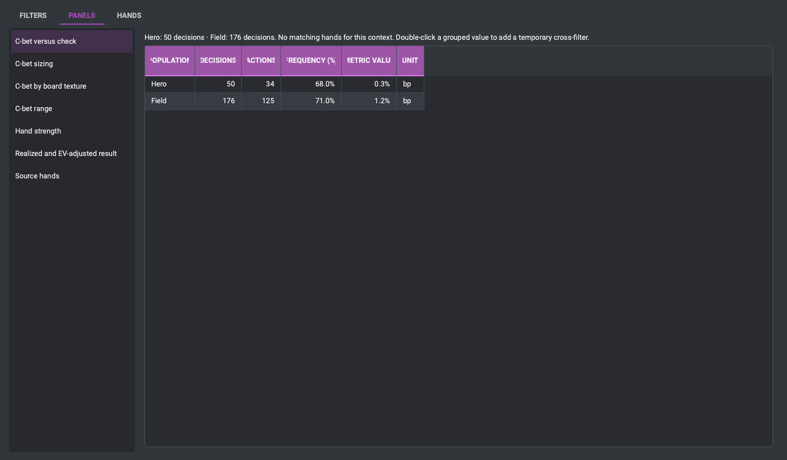
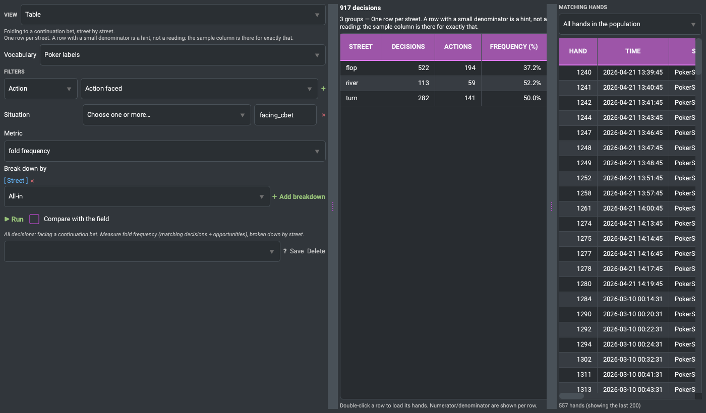
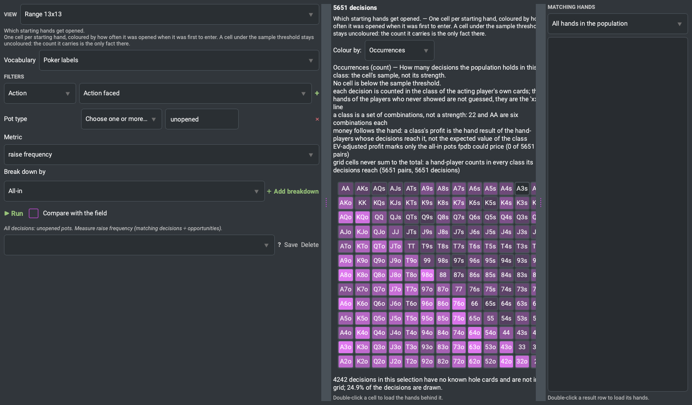
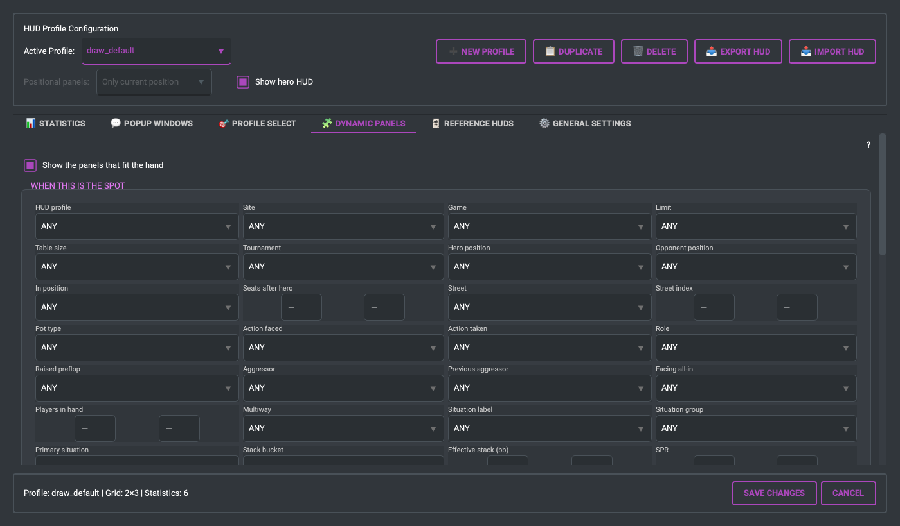

# FPDB-3 Standalone Legacy (Python)

Version 3.9.1 — release preparation.

See the [3.9.1 release notes](docs/RELEASE_NOTES_3.9.1.md) for the latest HUD,
parser, configuration and packaging changes.

The original FPDB-3 Python application: hand-history parsers, PySide6 GUI, statistics engine, and the HUD overlay. This repository hosts the standalone, self-contained legacy Python stack. It has been separated from the `fpdb-new` monorepo by removing all Rust and modern FastAPI components to keep it lightweight, fast, and easy to run.

## ✨ Highlights

- **Hand-History Import & Analysis** from 26 poker rooms. See [PARSER_SUPPORT.md](PARSER_SUPPORT.md) for which converters are covered by golden snapshots and which are kept only for historical archives.
- **Live capture** for rooms that write no hand-history files: SwC Poker (HTTP and native desktop), iPoker.
- **Real-Time HUD** overlay with draggable multiblock stats, positional panels, and a per-profile hero toggle.
- **FastHUD for fast-fold tables** with deterministic seat rotation, single-renderer ownership,
  duplicate-HUD interlocks, and platform contracts for macOS and Windows.
- **Auto Notes**: rule-driven player notes with a visual workbench and card miniatures.
- **Stats & analytics**: preflop/postflop/sizing/tournament stat modules, leak detector, player profiler.
- **Databases**: SQLite (default), PostgreSQL, MySQL/MariaDB — configurable from the GUI, with a cross-backend migration engine.
- **Localized**: 14 locale catalogues ship with the app; switch at runtime from *View → Language*.
- **PySide6 Desktop GUI**: The graphical interface has been completely ported to PySide6.
- **Self-Contained Platform Detection**: Window detection and geometry calculations are fully integrated for Linux, macOS, and Windows.

## 🔎 Advanced Poker Analytics

Beyond the classic reports, fpdb-3 answers poker questions about your own
database — without writing SQL, and without having to know which statistic to
ask for.

### Start from the spot

**Choose a spot → compare with the field → look at the picture → open the
hands.**

The **Study Explorer** names poker situations, not metrics. Pick the one you
want to work on and fpdb runs the seven or eight readings of it that are worth
having, all over the same population.



**Don't know which spot?** *Biggest Differences vs Field* compares every
curated study panel and ranks the spots where your frequencies differ most from
the people you actually play. It is a review queue, not a verdict — see
[Reading differences responsibly](docs/reading-differences.md).



**Compare.** Every study opens in Hero vs Field: each panel answers once over
your decisions and once over everyone else's, from the same query with the
population identity flipped, with the gap and both samples beside it.


**Visualize.** Sizing distributions, position matrices, board-texture heatmaps,
the 13×13 range grid, hand-strength composition, realized and EV-adjusted
profit — each a tab of the same study. Clicking a bar, a cell or a texture adds
a visible, removable cross-filter that narrows every panel and both sides at
once.



**Inspect the hands.** Under every panel, the hands behind the number, with
your population, your actions, the field's population and the field's actions
kept apart rather than merged into one ambiguous list. Double-click one to open
the replayer.



Shipped study packs: **No-limit Hold'em 6-max**, **Pot-Limit Omaha 6-max** and
**tournaments** (organised around effective stack depth rather than treating a
tournament hand as a cash hand with one more filter).

→ [Study Explorer quick start](docs/study-explorer-quick-start.md) — the whole
workflow in five minutes, on invented data.

### Custom / Advanced Research

When no study asks your question, the **Research Browser** is the power-user
path: one screen for building a query in poker words, reading the answer and
inspecting the hands behind it.



**Ask in poker words.** *Population* (who), *situation* (the spot), *metric*
(how often / how much) and *breakdown* (how it is split) are selected from poker
labels, and a plain-language sentence restates the query before it runs. A
**beginner** view offers the common controls; **expert** reveals the rest.

**A built-in library of 40+ presets** covers what players actually ask:

- **Preflop** — RFI, VPIP and PFR by position, 3-bet and 4-bet rates, blind
  defence versus a button open, squeeze opportunities, open and 3-bet sizing.
- **Postflop** — c-bet frequency and size, fold-versus-c-bet by size, delayed
  c-bets, turn probes, barrels, river overbets, check-raises.
- **Pot type** — c-betting and defence in 3-bet pots, aggression in 4-bet pots,
  first bet in a limped pot.
- **Board** — how suit structure, pairing and connectivity change the c-bet rate.
- **Range** — the 13×13 grid of what hero and opponents actually hold, and the
  **postflop hand-strength composition** (air / pair / set / draw) behind a bet.
- **Population** — the pool's baseline, so your numbers have something to sit
  beside.
- **Profit** — **realized profit** and the separate **EV-adjusted (all-in EV)**
  result, per decision and by pot type.



**A workbench, not one table.** Summary, Table, Frequencies, Sizing, Position,
Board, Range, Hand Strength, Profit and Hands are tabs of one screen; every view
keeps the denominator and numerator beside the value and names its sample size.
Double-clicking a hand opens it in the replayer.

### Reference HUDs

Three `.fpdbhud` packages ship ready to import (**Preferences → HUD → Import**):

- **Basic** — the eight numbers that answer "who am I playing against".
- **Advanced** — the same small grid over fpdb's hierarchical popups: preflop,
  single-raised pot, 3-bet pot, 4-bet pot, one click deep.
- **Dynamic** — context-aware panels that change with the situation: preflop,
  facing a c-bet, 3-bet pots, short stacks, sizing thresholds. Its rules are
  scoped to the Dynamic profile, so other profiles keep their current layout.
  Panel titles and compact stat headings are editable in the `.fpdbhud` package.


For multi-tabling, set `display_label` on a `<stat>` to use a short visible
heading while retaining the longer `tip` as its explanation. The profile's
`title_font_scale` and `heading_font_scale` control title and heading sizes. See
the [Advanced HUD guide](docs/hud-advanced-guide.md#tune-dynamic-panel-labels-in-a-package)
for the XML example and editing notes.



### Documentation

User guides (task-first, poker vocabulary) and the developer references beside
them:

| Guide | For |
| --- | --- |
| [Study Explorer quick start](docs/study-explorer-quick-start.md) | spot → compare → visualize → hands, in five minutes |
| [Reading differences responsibly](docs/reading-differences.md) | what a Hero-vs-Field gap is, and is not |
| [Reading the visualizations](docs/study-visualizations.md) | sizing, matrices, heatmaps, range grid, strength, EV |
| [Research for Omaha](docs/research-omaha.md) | the PLO study pack and what four cards change |
| [Research for tournaments](docs/research-tournaments.md) | the MTT pack, stack-depth bands, what fpdb cannot know |
| [Research Browser in five minutes](docs/research-quick-start.md) | the power-user path: building a query by hand |
| [Analytics concepts](docs/analytics-concepts.md) | opportunity, sample, SPR, pot type, realized vs EV |
| [Advanced HUD guide](docs/hud-advanced-guide.md) | the reference packages and popups |
| [Dynamic HUD guide](docs/hud-dynamic-guide.md) | panels, thresholds, what is truly live |
| [Reference HUD design system](docs/hud-design-system.md) | what each colour means, samples, panel titles |
| [Screenshots](docs/screenshots.md) | what each picture shows and how to regenerate it |
| [research-browser.md](docs/research-browser.md), [query-engine.md](docs/query-engine.md), [dynamic-panels.md](docs/dynamic-panels.md), [stat-definitions.md](docs/stat-definitions.md) | implementation reference |

Every screenshot above is generated from a **deterministic demo workspace** of
invented players — no private hand history is ever needed:

```sh
python tools/make_demo_workspace.py
python tools/capture_wiki_screenshots.py --config ~/fpdb-demo/HUD_config.xml --out docs/images
```

## 📦 Prebuilt downloads

Standalone builds for macOS (Apple Silicon), Windows x64 and Linux x64 are attached to every
[release](https://github.com/jejellyroll-fr/fpdb-3/releases/latest). They bundle their own Python
runtime — no install step. On macOS, read [docs/macos-gatekeeper.md](docs/macos-gatekeeper.md) first:
release artifacts are Developer ID signed and notarized only when the repository's macOS release
credentials are configured; otherwise the workflow publishes an ad-hoc artifact with the limitations
described there.

## Credits

FPDB-3 continues the original FPDB project, whose history predates the Python
3 migration. The complete historical contributor list is preserved in
[`contributors.txt`](contributors.txt), including project administration,
code, documentation, translations, testing and community support.

The Python 3 continuation is credited to MegaphoneJon and ChazDazzle, with
contributions from Bruno Duyé, Carl Gherardi and Samuele Fiorin (`sf-87`),
and current maintenance, release and documentation work by jejellyroll-fr.

### Existing clones after a history rewrite

If you cloned the repository before a history rewrite, do not pull directly
into the old branch. First preserve any local work, then realign the clone to
the remote branch. This keeps a recoverable pointer to your previous state:

```sh
git stash push -u -m "before fpdb history sync"
git fetch origin
git branch backup/before-fpdb-history-sync
git switch main
git reset --hard origin/main
git switch development
git reset --hard origin/development
```

Use the backup branch to recover local commits and `git stash pop` to restore
uncommitted work if needed. The `reset --hard` commands discard uncommitted
changes on the two local branches, which is why the stash command comes first.

The available packagers depend on the platform:

- macOS ships only `fpdb-pyoxidizer-macos-arm64`. Keeping a single signed app
  identity is required for reliable Screen Recording and Accessibility grants.
- Linux ships both the PyOxidizer single-interpreter build and the PyInstaller
  directory distribution.
- Windows ships the PyInstaller directory distribution, and builds the
  PyOxidizer single-interpreter bundle again (`fpdb-pyoxidizer-windows-x64`,
  restored after Issue #225). PyInstaller remains the supported Windows
  distribution: the PyOxidizer bundle is there to be compared against it, and
  it is not what HUD timing depends on -- how fast a Fast-Fold HUD fills in is
  decided by whether the client's chairs can be read from the table window (see
  `fpdb_3_legacy/winamax_ax_seats.py`), not by the packager.

## 🔧 Requirements

- Source installation: Python 3.11+ (3.13 recommended).
- PyOxidizer binaries: no system Python is required; the current PyOxidizer
  0.24 configuration embeds CPython 3.10.14 because it cannot link CPython
  3.11+. This is an implementation detail of the bundle, not the supported
  source-installation minimum.
- OS: Linux, Windows, macOS
- HUD: X11 (Linux), native window support (Windows/macOS)
- A C compiler and CMake — the equity engine is a native extension built at install time (see below)

## ⚙️ Install

From the repository root:

```bash
# venv + editable install with test extras (macOS/Linux)
python3 -m venv .venv
source .venv/bin/activate
pip install -e .[test]

# or with uv (faster)
uv pip install -e .[test]
```

On Windows PowerShell, create and activate the environment with
`py -3 -m venv .venv` and `.venv\Scripts\Activate.ps1`, then run the same
`pip install` command.

Platform/feature extras: `.[linux]`, `.[windows]`, `.[macos]`, `.[postgresql]`, `.[mysql]`.

### Native equity engine

Equity calculations (AoF analyses, hand replayer EV) use the
[pypoker-eval](https://github.com/jejellyroll-fr/poker-eval) C extension. It is a **required**
dependency, pinned to `v1.2.0`, and pip builds it from source during the install above — which is
why a C compiler and CMake are needed. See [docs/EQUITY_ENGINE.md](docs/EQUITY_ENGINE.md).

## ▶️ Run

```bash
# Full launcher (console script — runs fpdb_3_legacy/legacy_launcher.py)
uv run fpdb_3_legacy

# Desktop GUI directly
python fpdb_3_legacy/fpdb.pyw

# HUD process
python fpdb_3_legacy/HUD_main.pyw
```

### macOS prebuilt builds

For an ad-hoc build (including a release built without the optional signing secrets), Gatekeeper
assesses the `fpdb.app` bundle as a unit, but the app is not notarized and its privacy identity is
not stable across builds. Move the bundle out of `~/Downloads` and clear the quarantine attribute:

```bash
mv ~/Downloads/fpdb.app /Applications/
xattr -dr com.apple.quarantine /Applications/fpdb.app
```

Extracting the archive with `tar` rather than Finder avoids the quarantine flag in the first place.
Full explanation in [docs/macos-gatekeeper.md](docs/macos-gatekeeper.md).

The 3.7.0 release also hardens the fast-fold HUD lifecycle: only one renderer may own a table,
stale overlays are removed, and the HUD reports the process holding the interlock when a second
instance is refused.

### Linux / Wayland

```bash
./fpdb-xwayland.sh        # from repo root
# or: export FPDB_FORCE_X11=1
```

### Profiling

Profiling is off by default. To record a session, set `FPDB_PROFILE=1`; fpdb
then writes a `.prof` and a readable summary to `~/fpdb_profiles` on exit.

```bash
FPDB_PROFILE=1 python fpdb_3_legacy/fpdb.pyw
```

## 🧪 Tests

From the repository root:

```bash
make test                 # main suite (excludes GUI)
make test-all             # incl. GUI (using run_tests.sh)
uv run pytest -k "stats"  # pattern
make lint && make format
```

Parser behaviour is locked by a golden-master corpus (`tests/fixtures/`) with per-hand invariant
checks. Adding a hand-history fixture under `tests/fixtures/hands/<room>/` also requires an entry in
`tests/fixtures/hands/live_parser_snapshots.json` — `test_live_parser_regression.py` globs each room
directory and fails on any file the manifest does not cover.

## 🗂 Layout (selected)

```
fpdb_3_legacy/
├── *ToFpdb.py            # one parser per poker room
├── iPoker/               # iPoker parser split into mixins
├── Hand.py, Database.py  # core hand model + DB layer
├── Hud.py, HUD_main.pyw  # HUD overlay
├── AutoNotes*.py         # auto-note rules engine
├── *_capture*.py         # SwC / iPoker live capture
├── fpdb.pyw              # desktop GUI entry point
└── legacy_launcher.py    # `fpdb_3_legacy` console script
fpdb/
└── infrastructure/platform/  # platform window and geometry detection
locale/                   # gettext .po catalogues (14 locales)
tests/fixtures/           # golden-master hand-history corpus
docs/                     # equity engine, macOS Gatekeeper, SwC capture, issue reporting
```

## 📄 License

AGPL v3 — see [LICENSE](LICENSE).
