# The reference HUD design system

fpdb ships three HUDs. They used to look like three products: three sample
thresholds, three ways of writing a panel name, three greens that each meant
something slightly different. The engine was never the problem — nothing said
what a colour *meant*, so each package answered for itself.

This is the answer, in one place. The rules live in
`fpdb_3_legacy/hud_presentation.py`, the packages are checked against them by
`tests/test_hud_presentation.py`, and the pictures below are rendered from the
packages themselves by `tools/render_reference_huds.py`.

## The three packages

| | | |
| --- | --- | --- |
| **Basic** | 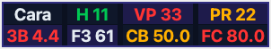 | Eight numbers, no configuration, no analytics tables. Readable by somebody who has just imported their first hands. |
| **Advanced** | 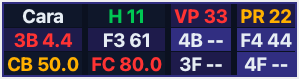 | The same small surface, with the shipped popup library one click behind every cell. |
| **Dynamic** | 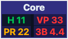 | A core block that never moves, plus one contextual panel the resolver chooses from the spot. |

All three can be inspected without a poker table: **Preferences → HUD →
🃏 Reference HUDs** renders them with fictional data, walks the Dynamic
package through every context, and lists every popup path.

## Information hierarchy

Every visible cell is one of six things, and its role decides the background it
is drawn on:

| Role | Background | What it is |
| --- | --- | --- |
| identity | slate | who this seat is, and the notes behind it |
| sample | slate | how many hands everything else is based on |
| core | indigo | the handful of numbers that describe a player at all |
| contextual | deep blue | a number about the spot in front of this seat now |
| analytics | deep indigo | backed by the analytics tables, not a native column |
| navigation | slate | a link: this cell opens a popup rather than answering |

### Never colour alone

A role is carried by three channels, not one:

* the **background**, as above;
* the **prefix** every cell carries — `H ` is the sample, `VP` and `PR` are core
  preflop, `CB` and `FC` are the flop c-bet pair. A prefix survives a
  colour-blind palette, a greyscale print and a HUD the user has themed;
* the **tooltip**, which every visible abbreviation has. A test fails the build
  if one does not.

A navigation row is marked a fourth way: the popup renderer draws a chevron `›`
where a value would be, so a link never reads as a number that failed to load.

## Samples, and what a thin one looks like

One rule, all three packages:

* under **25 hands** the sample is drawn in the warning colour — the number
  beside it is a rumour;
* over **200 hands** it is drawn in the confident colour;
* a **contextual** or analytics-backed stat needs **40** decisions before it is
  shown at all, because a c-bet-by-position number over twelve hands looks
  precise and is not;
* where a number cannot honestly be printed, all three print the same thing
  rather than three spellings of "not enough hands".

The screenshots on this page are deliberately rendered at eleven hands: the
low-sample state is the one a reader most needs to recognise, and a picture of
the comfortable case teaches nothing.

## Dynamic panels say which spot they are about

A dynamic panel used to title itself with the rule id that selected it —
`srp_cbet_ip` — which is the one thing the reader already cannot see. Each one
now announces the spot, as a path through the hand:

| | |
| --- | --- |
| 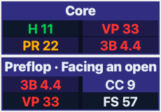 | 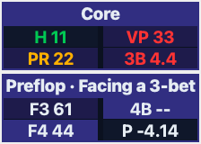 |
| 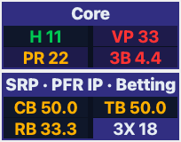 | 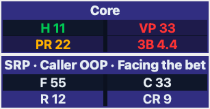 |
| 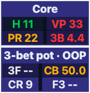 | 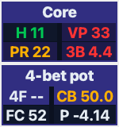 |
| 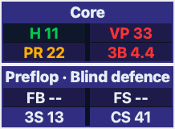 | 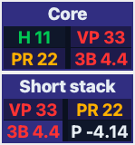 |

The title is presentation; the block's `id` is still the identity the resolver
matches a rule against, so renaming a panel for a reader cannot stop a rule
finding it.

## Popup navigation runs in the order a hand is played

Every spot menu, in every package, lists its rows in the same order:

1. Preflop
2. Single-raised pot
3. 3-bet pot
4. 4-bet pot
5. Sizing
6. Stacks
7. Position
8. Population / Research

A reader learns the shape once and then knows where to look in all of them.
Rows deeper in — "Flop aggression, Turn, River" — are a street order inside one
spot, and the spot table has nothing to say about those.

A child page never repeats its parent. The player, the sample and the result
travel with every page because they are context; anything else repeated would
be a click that bought nothing.

## Changing a package

1. edit the `.fpdbhud` in `hud-packages/`;
2. run `pytest tests/test_hud_presentation.py tests/test_reference_hud_packages.py`
   — the contract is enforced, not documented;
3. run `QT_QPA_PLATFORM=offscreen python tools/render_reference_huds.py` to
   refresh the images on this page. `--check` reports what would change without
   writing, which is what CI would use.

A package that drifts from the rules above fails a test with the cell, the
panel or the popup named.
