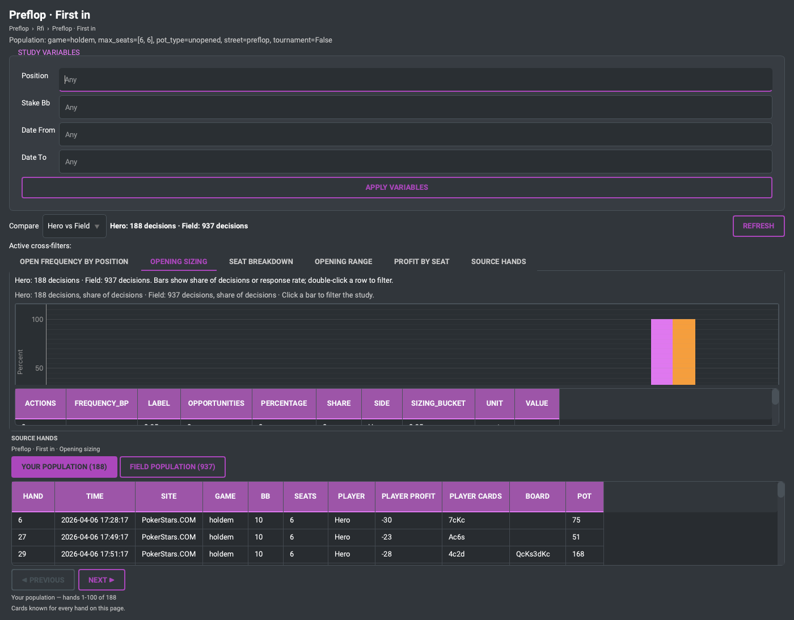

# Study Explorer quick start

The Research Browser asks you for a metric, a situation, a breakdown and a
population, and then answers. That is a good tool once you know what you want
to ask. The **Study Explorer** is the other way round: you name the *spot*, and
fpdb runs the seven or eight readings of that spot that are worth having.

Four steps, and none of them is a query:

> **Choose a spot → compare with the field → look at the picture → open the
> hands.**


## A study is not a saved query

| | Study | Custom / Advanced Research |
| --- | --- | --- |
| You name | a poker spot | a metric, filters, a breakdown |
| You get | several coordinated panels over one population | one answer |
| Good for | "how do I play single-raised pots as the raiser in position" | "fold-to-c-bet on monotone boards, 40–60bb, last 90 days" |
| Needs | nothing | knowing what you want to ask |

Both read the same engine and the same hands. The Browser is still there, under
**Custom / Advanced Research**, and everything below can be reproduced in it by
hand — the study is the shortcut, not a different truth.

## The spot hierarchy

Studies are filed by where in the hand they happen, not by which statistic they
use:

* **Preflop** — first in, facing an open, the opener facing a 3-bet, squeeze,
  blind defence;
* **Single-Raised Pots** — the raiser and the caller, in and out of position,
  across the streets;
* **3-bet Pots** and **4-bet Pots** — the aggressor and the defender;
* **Database / Population** — the pool you are being compared against.

Two filters decide which hierarchy you see: **Game** (Hold'em, Pot-Limit Omaha)
and **Format** (cash, tournaments). They are not decoration — a study declares
the game and the format it is about, so choosing Pot-Limit Omaha hides the
Hold'em studies rather than running them against Omaha hands. See
[the PLO guide](research-omaha.md) and
[the tournament guide](research-tournaments.md).

## Variables

A study's **variables** are the choices it leaves you: position, the opposing
seat, stake, effective stack, dates. Setting one applies it to *every panel at
once*, which is the whole point — a study is several readings of one
population, and a variable that only moved one panel would break that.

## Hero vs Field

Every study opens in **Hero vs Field**. Each panel answers twice: once over
your decisions, once over everybody else's in the same database, with the same
filters. The two sides differ in exactly one thing — whose decisions they are.

The **gap** is your value minus the field's. It is the column that makes the
rest actionable: a frequency on its own is a measurement, and "am I 3-betting
enough" has no answer without a second number.

Before you read a gap as a finding, read
[Reading differences responsibly](reading-differences.md). The field is what
the players in *your* database did. It is not a solution.

## Sample sizes

Every number travels with the sample it came from, and a study declares a
minimum below which it does not draw a row at all. A gap is only as good as the
smaller of the two samples beside it: 60% against 52% is a fact over four
thousand decisions and a coin-flip over nine.

## Cross-filters

Clicking a bar, a matrix cell or a board texture adds a **cross-filter**: a
visible, removable chip that narrows every panel in the study at once, and both
sides of the comparison identically. Click the chip to take it off.

That is how a study goes from "how do I play this spot" to "how do I play this
spot on paired boards, out of position, at 40–60bb" without ever opening a
query builder.

## Source hands

Under every panel is **Source hands**: the hands behind the number, with the
two sides kept apart —

```
[ Your population (296) ] [ Your actions (42) ]
[ Field population (11,880) ] [ Field actions (1,283) ]
```

*Population* is the denominator — every decision the number was computed over.
*Actions* is the numerator — the decisions where the thing actually happened.
Hero hands and field hands are never merged into one ambiguous list.

Double-click a hand to open it in the replayer.

Hole cards are shown only where the database recorded them. Field coverage is
much lower than yours — you always know your own cards, and you only know
somebody else's at showdown — and the pane says so rather than leaving a blank
column to be read as "no cards".

---

## The five-minute tour

This is the whole feature, end to end, on the deterministic demo workspace
(`python tools/make_demo_workspace.py`). No private hands, and the numbers below
are the ones the demo corpus is built to produce.

**1. Open Research → Study Explorer.**

**2. Open `Biggest Differences vs Field`.** It compares every curated study
panel for you and ranks what it finds.


**3. Pick the largest difference.** On the demo corpus the top rows are the
hero's, by construction: the demo hero folds to a flop c-bet far more than the
field does, folds to opens more, and opens the button more. Rows are ranked by
|gap| × the smaller sample, so a large gap over nine hands does not outrank a
moderate one over nine hundred.

**4. Open the study, and read Overview.** The headline frequency for the spot,
your side beside the field's.


**5. Switch to Sizing, or Board.** The same population, read through the axis
that might explain the gap.




**6. Cross-filter the spot.** Click the board texture or the sizing bucket that
looks unusual. Every panel follows, both sides of the comparison follow, and the
chip above the panels says what you narrowed to.

**7. Open your source hands.** Your population, then your actions.


**8. Open the field's.** The same filters, the other population. This is the
step that turns "the field folds less here" into "here is what the field
actually did".

**9. Double-click a hand.** The replayer opens on it.

At no point did you open Custom / Advanced Research. If you want to — for a
question no study asks — it is one button away, and
[its own quick start](research-quick-start.md) starts there.

## Where to go next

* [Reading differences responsibly](reading-differences.md) — what a gap is and
  is not.
* [Reading the visualizations](study-visualizations.md) — how to read each
  chart.
* [Research for Omaha](research-omaha.md) and
  [Research for tournaments](research-tournaments.md) — the game-specific packs.
* [The Research Browser quick start](research-quick-start.md) — the power-user
  path.
