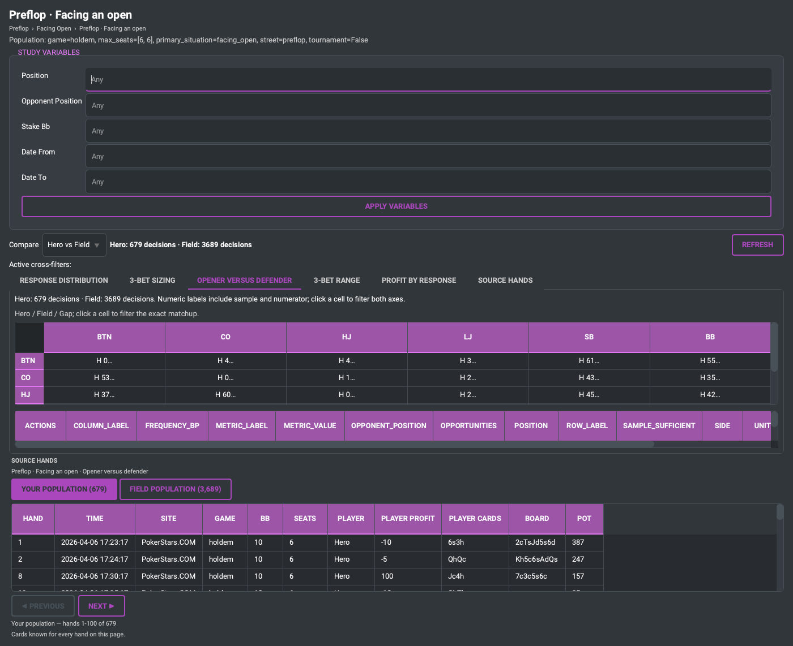
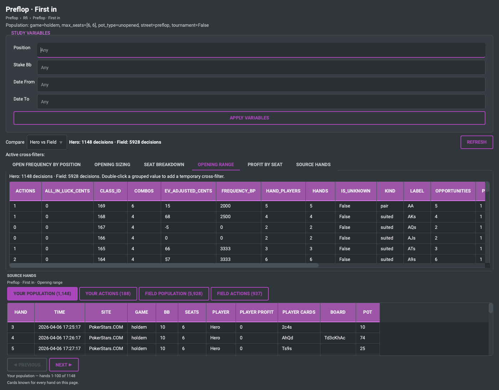
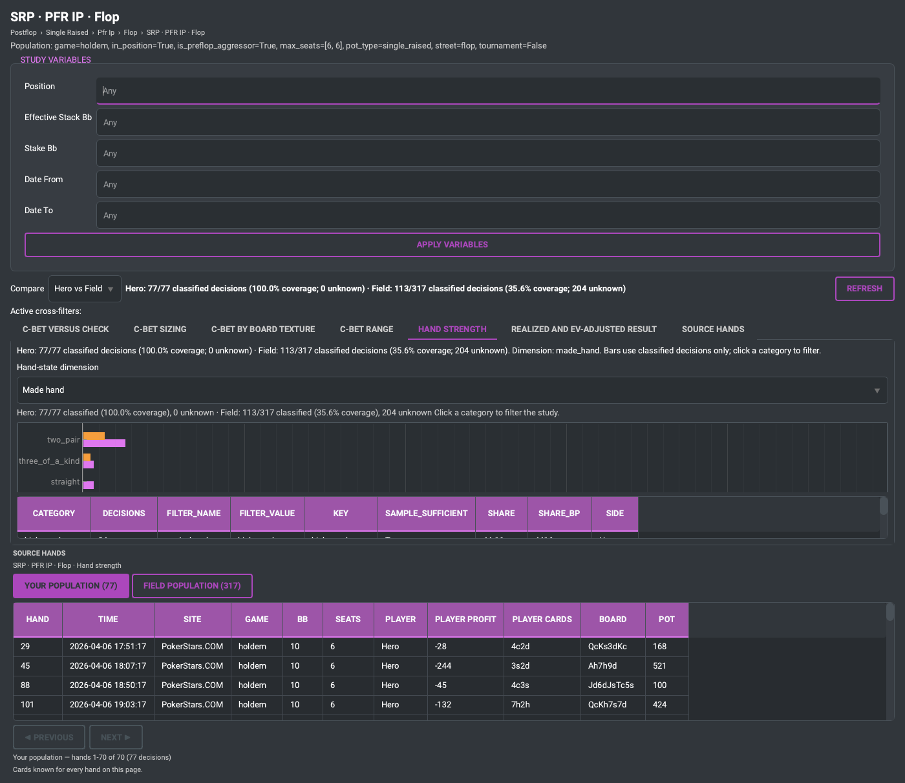
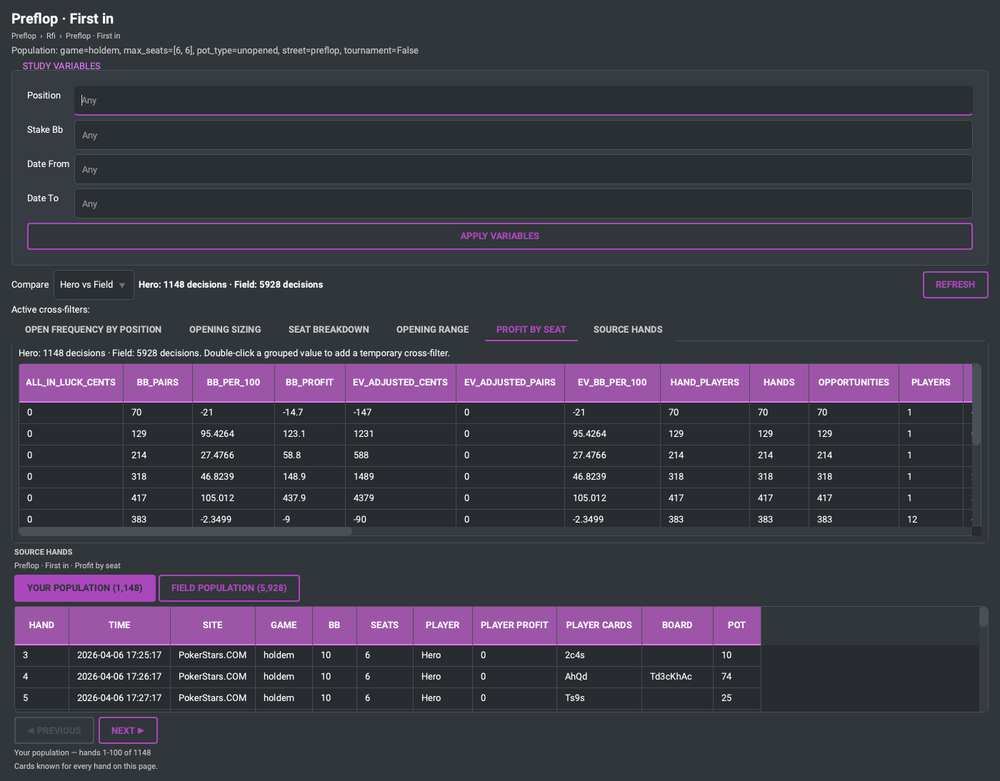

# Reading the visualizations

Every panel in a study is a different way of cutting the same population.
This page is how to read each one, and what each one can and cannot tell you.

Two rules hold everywhere:

* **the sample travels with the number** — every bar, cell and category carries
  the decisions behind it, and a thin one says so;
* **a comparison panel shows both sides** — yours and the field's, from the
  same query with the population identity flipped.

## Sizing distribution

**What it is.** Every bet in the spot, bucketed by size as a share of the pot,
with the share of bets in each bucket and — where the panel is about a response
— the rate at which each size got folded to.

**How to read it.** Look at the *shape*, not the tallest bar. A player who bets
one size has a different problem from one who spreads across five. Empty
buckets are kept rather than dropped: "never bets small" is a finding, and a
histogram that silently omits the bucket hides it.

**What it cannot tell you.** Whether a size was right. It reports what was bet.

**Click a bar** to cross-filter the whole study to that size.

## Position matrix

**What it is.** A frequency broken down across two seat axes at once — your
position against the opener's, typically — with the gap against the field in
each cell.

**How to read it.** Read rows and columns before cells. A whole row that
differs means something about that seat; one cell that differs over thirty
decisions usually means nothing yet. Cells carry their numerator and
denominator, so a striking percentage can be checked against the hands behind
it before you believe it.

**Click a cell** to cross-filter both axes at once.

## Board texture heatmap

**What it is.** The same frequency laid out over board suit structure against
pairing (or connectivity), so the texture the decision was made on becomes an
axis rather than an average.

**How to read it.** Boards are not evenly distributed: monotone flops are rare
and the cell will be thin. A dark cell over forty decisions is a lead; a dark
cell over six is the shuffle. The unknown row is for hands whose board was
never classified, and it is kept visible rather than folded into a texture it
does not belong to.

## Range grid

**What it is.** The 13×13 grid of starting hands, coloured by how often each
class took the action the panel is about.

**How to read it.** The grid is a picture of a *range*, so read blocks rather
than squares: pairs down the diagonal, suited above it, offsuit below. A hole
in an otherwise solid block is usually sample, not strategy.

**When it is not shown.** The grid describes two hole cards. It has no meaning
for a four-card game, so an Omaha study does not ship one and a Hold'em study
opened against Omaha hands disables it and says why — rather than drawing a
grid of the first two cards, which would be a confident answer to a question
nobody can answer.

## Hand-strength distribution

**What it is.** What the player actually held when they made the decision —
made hand, pair detail, draws, nutness, blockers — for the hands where the
cards are known.

**How to read it.** Read the coverage line first. It says how many decisions
were classified, how many were not, and the classification is only possible
where the cards were recorded. Your own coverage is near total; the field's is
whatever went to showdown, which is a small and *biased* subset — hands that
reach showdown are not a random sample of hands played.

Categories can overlap (a hand can be a pair and a draw), so the shares do not
have to sum to 100%, and the panel says so rather than normalising the numbers
into a shape they do not have.

**When it is not shown.** Only for games the postflop classifier reads. An
Omaha hand's best two cards are not a Hold'em hand, so the panel is disabled
with its reason instead of classifying four cards as two.

## Profit and EV

**What it is.** Two different numbers, kept apart: **realized** profit — what
actually landed in the stack — and the **all-in EV adjusted** result, which
replaces the outcome of all-in pots with their equity.

**How to read them together.** Realized is what happened. EV-adjusted is what
was, on average, going to happen. A large difference between them over a decent
sample is variance in all-in pots, which is the one thing in this whole page
that says nothing about how anybody played.

Neither is a per-decision EV: fpdb does not compute the value of a fold or of a
bet that did not go all in, and the panel does not pretend to.

## Source hands

Under every panel, the hands behind it, with the two populations kept apart and
the denominator and the numerator offered separately. This is the last step of
every reading above: the picture tells you where to look, and the hands tell
you what happened.

---

See also: [Study Explorer quick start](study-explorer-quick-start.md) ·
[Reading differences responsibly](reading-differences.md)
