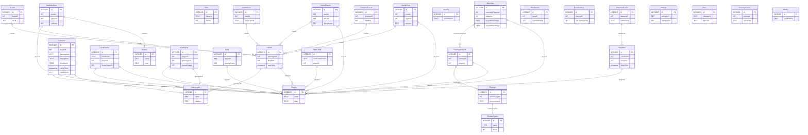

```mermaid
erDiagram
    Actions {
        INTEGER id PK
        TEXT name
        TEXT code
    }

    Autorates {
        INTEGER id PK
        INT playerId
        INT gametypeId
        TEXT description
        TEXT shortDesc
        timestamp ratingTime
        INT handCount
    }

    Backings {
        INTEGER id PK
        INT tourneysPlayersId
        INT playerId
        REAL buyInPercentage
        REAL payOffPercentage
    }

    Boards {
        INTEGER id PK
        INT handId
        TEXT cards
    }

    CardsCache {
        INTEGER id PK
        TEXT startCards
        INT playerId
        INT activePlayerId
    }

    Files {
        INTEGER id PK
        TEXT filename
        INT fileSize
    }

    Gametypes {
        INTEGER id PK
        TEXT name
        TEXT category
    }

    Hands {
        INTEGER id PK
        INT gametypeId
        INT playerId
        timestamp startTime
    }

    HandsActions {
        INTEGER id PK
        INT handId
        INT playerId
        INT actionId
    }

    HandsPlayers {
        INTEGER id PK
        INT handId
        INT playerId
        TEXT playerName
    }

    HandsPots {
        INTEGER id PK
        INT handId
        INT playerId
        REAL amount
    }

    HandsStove {
        INTEGER id PK
        INT handId
        TEXT stoveCards
    }

    HudCache {
        INTEGER id PK
        INT playerId
        INT gametypeId
        INT handsPlayed
    }

    Months {
        INTEGER id PK
        TEXT monthName
    }

    Players {
        INTEGER id PK
        TEXT name
        TEXT alias
    }

    PositionsCache {
        INTEGER id PK
        INT positionId
        INT handId
    }

    Rank {
        INTEGER id PK
        INT playerId
        INT rankingPoints
    }

    RawHands {
        INTEGER id PK
        INT handId
        TEXT rawHandData
    }

    RawTourneys {
        INTEGER id PK
        INT tourneyId
        TEXT rawTourneyData
    }

    Sessions {
        INTEGER id PK
        INT sessionId
        INT playerId
        timestamp startTime
    }

    SessionsCache {
        INTEGER id PK
        INT sessionId
        TEXT cacheData
    }

    Settings {
        INTEGER id PK
        TEXT settingKey
        TEXT settingValue
    }

    Sites {
        INTEGER id PK
        TEXT siteName
        TEXT siteURL
    }

    StartCards {
        INTEGER id PK
        TEXT cardCombination
        INT playerId
    }

    TourneyTypes {
        INTEGER id PK
        TEXT name
        INT buyIn
    }

    Tourneys {
        INTEGER id PK
        INT tourneyTypeId
        TEXT tourneyName
    }

    TourneysCache {
        INTEGER id PK
        INT tourneyId
        TEXT cacheData
    }

    TourneysPlayers {
        INTEGER id PK
        INT tourneyId
        INT playerId
    }

    Weeks {
        INTEGER id PK
        TEXT weekName
    }

    %% Relationships
    Autorates ||--o{ Players : "playerId"
    Autorates ||--o{ Gametypes : "gametypeId"
    Backings ||--o{ TourneysPlayers : "tourneysPlayersId"
    Backings ||--o{ Players : "playerId"
    Boards ||--o{ Hands : "handId"
    CardsCache ||--o{ Players : "playerId"
    CardsCache ||--o{ Players : "activePlayerId"
    Hands ||--o{ Gametypes : "gametypeId"
    Hands ||--o{ Players : "playerId"
    HandsActions ||--o{ Hands : "handId"
    HandsActions ||--o{ Players : "playerId"
    HandsActions ||--o{ Actions : "actionId"
    HandsPlayers ||--o{ Hands : "handId"
    HandsPlayers ||--o{ Players : "playerId"
    HandsPots ||--o{ Hands : "handId"
    HandsPots ||--o{ Players : "playerId"
    HandsStove ||--o{ Hands : "handId"
    HudCache ||--o{ Players : "playerId"
    HudCache ||--o{ Gametypes : "gametypeId"
    PositionsCache ||--o{ Hands : "handId"
    Rank ||--o{ Players : "playerId"
    Sessions ||--o{ Players : "playerId"
    SessionsCache ||--o{ Sessions : "sessionId"
    StartCards ||--o{ Players : "playerId"
    Tourneys ||--o{ TourneyTypes : "tourneyTypeId"
    TourneysPlayers ||--o{ Tourneys : "tourneyId"
    TourneysPlayers ||--o{ Players : "playerId"
```